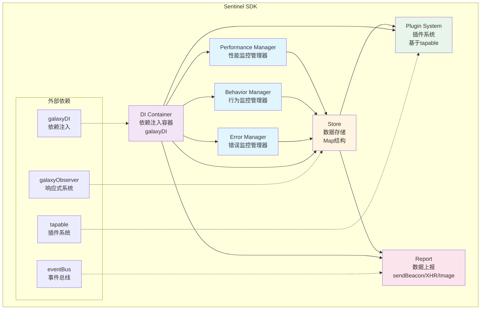

# Galaxy

Galaxy 是一个基于 pnpm workspace 的 monorepo 项目，包含多个功能模块和工具包。

## 📦 项目结构

```
galaxy/
├── apps/              # 应用目录
│   └── solar/         # Next.js 应用示例
├── packages/          # 核心包目录
│   ├── eventBus/      # 事件总线
│   ├── galaxyDI/      # 依赖注入容器
│   ├── galaxyObserver/# 响应式系统
│   └── sentinel/      # 前端监控 SDK
└── tools/             # 工具脚本
```

## 🎯 核心包介绍

### eventBus

轻量级事件总线，提供发布订阅模式，支持事件监听、取消监听和一次性监听。

**功能特性：**

- 类型安全的事件订阅/发布
- 支持一次性事件监听（`once`）
- 支持批量取消订阅

**使用示例：**

```typescript
import { EventBus } from "eventBus";

const bus = new EventBus<string>();
bus.subscribe("event", () => console.log("triggered"));
bus.publish("event");
```

### galaxyDI

依赖注入容器，提供类似 Angular 的依赖注入能力，支持构造函数注入和依赖解析。

**功能特性：**

- 支持 `useClass`、`useValue`、`useFactory`、`useDefinedValue` 多种提供方式
- 自动依赖解析
- 支持构造函数参数注入

**使用示例：**

```typescript
import { createContainer, resolveContainer } from "galaxyDI";

const container = resolveContainer(
	createContainer([
		{
			name: "service",
			useClass: MyService,
			deps: ["dependency"],
		},
	]),
);

const service = container.get<MyService>("service");
```

### galaxyObserver

响应式系统，提供类似 Vue 3 的响应式能力，包括 `reactive`、`ref`、`computed`、`watch` 等 API。

**功能特性：**

- 基于 Proxy 的响应式实现
- 支持 `reactive`、`readonly`、`shallowReactive` 等多种响应式类型
- 提供 `ref`、`computed`、`watch` 等组合式 API
- 完整的依赖追踪和副作用管理

**使用示例：**

```typescript
import { reactive, watch } from "galaxyObserver";

const state = reactive({ count: 0 });
watch(
	() => state.count,
	(newVal) => {
		console.log("count changed:", newVal);
	},
);
```

### sentinel

前端监控 SDK，提供全面的性能监控、行为监控和错误监控能力。

#### 核心功能

**1. 性能监控**

- **FP (First Paint)**: 首次绘制时间
- **FCP (First Contentful Paint)**: 首次内容绘制时间
- **LCP (Largest Contentful Paint)**: 最大内容绘制时间
- **FID (First Input Delay)**: 首次输入延迟
- **静态资源监控**: DNS、TCP、SSL、TTFB、传输时间等

**2. 行为监控**

- **页面信息**: 页面 URL、标题、时间戳等
- **路由变化**: SPA 路由切换记录
- **PV 统计**: 页面访问量统计
- **用户来源**: 来源页面、来源域名等
- **用户代理**: 浏览器、设备信息解析
- **HTTP 请求**: Fetch 和 XMLHttpRequest 拦截
- **自定义行为**: 支持用户自定义行为上报

**3. 错误监控**

- 应用错误捕获（开发中）

**4. 插件系统**

- 基于 `tapable` 的插件架构
- 支持生命周期钩子（`beforeInit`、`afterInit` 等）
- 可扩展的插件机制

**5. 数据上报**

- 支持多种上报方式：`navigator.sendBeacon`、`XMLHttpRequest`、`Image`
- 支持立即上报和延迟上报
- 支持批量上报和请求合并

#### 架构设计

**架构流程图：**



**架构说明：**

```
┌─────────────────────────────────────────────────────────────┐
│                      Sentinel SDK                            │
├─────────────────────────────────────────────────────────────┤
│                                                               │
│  ┌──────────────┐  ┌──────────────┐  ┌──────────────┐      │
│  │  性能监控     │  │  行为监控     │  │  错误监控     │      │
│  │ Performance  │  │   Behavior   │  │    Error     │      │
│  │   Manager    │  │   Manager    │  │   Manager    │      │
│  └──────┬───────┘  └──────┬───────┘  └──────┬───────┘      │
│         │                 │                  │               │
│         └─────────────────┼──────────────────┘               │
│                           │                                    │
│                  ┌────────▼────────┐                          │
│                  │   Store (存储)   │                          │
│                  │   - Map<K, T>   │                          │
│                  └────────┬────────┘                          │
│                           │                                    │
│         ┌─────────────────┼─────────────────┐                 │
│         │                 │                 │                 │
│  ┌──────▼──────┐  ┌───────▼──────┐  ┌──────▼──────┐         │
│  │  插件系统    │  │  数据上报     │  │  依赖注入     │         │
│  │   Plugin    │  │    Report    │  │     DI      │         │
│  │   System    │  │              │  │  Container  │         │
│  └─────────────┘  └──────────────┘  └─────────────┘         │
│                                                               │
│  ┌──────────────────────────────────────────────────────┐    │
│  │              外部依赖                                  │    │
│  │  - galaxyObserver (响应式系统)                        │    │
│  │  - galaxyDI (依赖注入)                                │    │
│  │  - eventBus (事件总线)                                │    │
│  │  - tapable (插件系统)                                 │    │
│  └──────────────────────────────────────────────────────┘    │
└─────────────────────────────────────────────────────────────┘
```

#### 架构亮点

1. **依赖注入架构**
   - 使用 `galaxyDI` 实现松耦合的模块设计
   - 所有核心模块通过 DI 容器管理，便于测试和扩展
   - 支持依赖自动解析和注入

2. **插件化设计**
   - 基于 `tapable` 的插件系统，提供丰富的生命周期钩子
   - 支持自定义插件扩展功能
   - 插件可以在数据收集、上报等各个环节进行拦截和处理

3. **响应式数据管理**
   - 使用 `galaxyObserver` 实现响应式数据存储
   - 通过 `watch` 监听指标变化，应对性能数据的异步收集问题
   - 数据变化自动触发上报逻辑

4. **多维度监控**
   - 性能监控：覆盖 Web Vitals 核心指标
   - 行为监控：完整的用户行为追踪链路
   - 错误监控：应用错误捕获和分析

5. **智能上报策略**
   - 支持 `sendBeacon` 在页面卸载时可靠上报
   - 延迟上报和批量合并，减少网络请求
   - 使用 `requestIdleCallback` 在浏览器空闲时上报，不影响页面性能

6. **类型安全**
   - 完整的 TypeScript 类型定义
   - 类型安全的指标枚举和值类型映射

**使用示例：**

```typescript
import { createDIContainer } from "sentinel";

const container = createDIContainer({
	appId: "your-app-id",
	plugins: [customPlugin],
	report: {
		path: "https://your-report-endpoint.com",
		immediateReport: false,
		lazyReportTimeout: 1000,
	},
	behavior: {
		maxBehaviorStack: 100,
	},
});
```

## 🛠️ 开发工具

### 代码质量

- **ESLint**: 代码质量检查
- **Prettier**: 代码格式化
- **Stylelint**: 样式代码检查
- **Husky**: Git hooks 管理
- **lint-staged**: 暂存文件 lint

### 构建工具

- **Rollup**: 库包构建（eventBus、galaxyDI、galaxyObserver）
- **Webpack**: 应用构建（sentinel）
- **TypeScript**: 类型检查和编译

## 📝 开发规范

### Monorepo 配置心得

#### package.json

- **engines**: 对于 NPM 来说，`engines` 只是起说明作用，即使用户安装的版本不符合要求，也不影响依赖包的安装。但使用 pnpm 和 yarn 安装，如果版本不符合要求会导致安装失败

#### ESLint VS Prettier

- **Prettier**: 负责代码格式化（formatting）
- **ESLint**: 负责代码质量检查（code-quality）
- Prettier 对代码错误不做检查

**为什么会有冲突？**

- Linter 里有许多代码风格规则与 Prettier 冲突
- 建议使用 `eslint-config-prettier` 禁用 ESLint 中与 Prettier 冲突的规则

## 🚀 快速开始

### 安装依赖

```bash
pnpm install
```

### 开发

```bash
# 并行运行所有包的 dev 脚本
pnpm dev

# 运行特定包
pnpm --filter <package-name> dev
```

### 构建

```bash
# 构建所有包
pnpm build

# 构建特定包
pnpm --filter <package-name> build
```

### 测试

```bash
# 运行所有测试
pnpm test

# 运行特定包的测试
pnpm --filter <package-name> test
```

### 代码检查

```bash
# Lint 检查
pnpm lint

# 自动修复
pnpm lint:fix
```

## 📄 License

ISC
